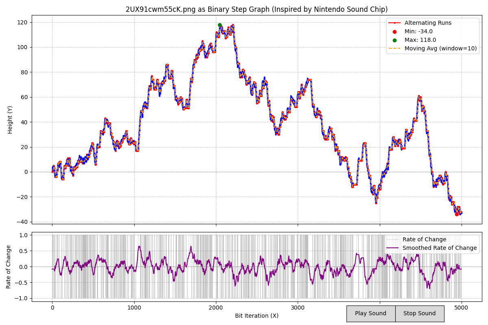

# DataSonifier

Turn any file into a musical and visual experience! This script reads a file as a binary string, converts it into a step graph (inspired by the Nintendo sound chip), and plays it as a melody using a pentatonic scale.

## Downloads
Download the pre-built executable for your platform (no Python installation required):
- [Windows (64-bit)](https://github.com/EatPowerNode/DataSonifier/releases/download/v0.0.1/sonifier-windows-latest.zip)
- [Linux (64-bit)](https://github.com/EatPowerNode/DataSonifier/releases/download/v0.0.1/sonifier-linux-latest.zip)
- [macOS (64-bit)](https://github.com/EatPowerNode/DataSonifier/releases/download/v0.0.1/sonifier-macos-latest.zip)

## Requirements
For running the Python script directly:
- Python 3.x
- Install dependencies:

  pip install matplotlib numpy pygame

## How to Run
### Option 1: Using the Executable
1. Download the executable for your platform from the links above.
2. Double-click the executable to run it (e.g., `sonifier-windows.exe` on Windows).
3. A file dialog will open. Select any file to sonify (e.g., an executable, text file, or image).
4. A graph will display, showing the height path and rate of change of the binary data.
5. Click the "Play Sound" button to hear the file as a melody. Use "Stop Sound" to interrupt playback.

### Option 2: Using the Python Script
1. Save the script as `sonifier.py`.
2. Run the script:

   python sonifier.py

3. A file dialog will open. Select any file to sonify (e.g., an executable, text file, or image).
4. A graph will display, showing the height path and rate of change of the binary data.
5. Click the "Play Sound" button to hear the file as a melody. Use "Stop Sound" to interrupt playback.

## Features
- Visualizes binary data as a step graph with alternating runs highlighted in red.
- Plots the rate of change to show the trend driving the sound.
- Plays the data as a melody using a C major pentatonic scale, with smooth pitch changes and a rhythmic beat.
- Interactive play/stop buttons to control sound playback.
- Non-blocking audio playback for a responsive UI.

## Example
Here’s what the output looks like when sonifying a random image file (`2UX91cwm55ck.png`):

The top graph shows the height path of the binary data, with alternating runs in red. The bottom graph shows the rate of change, which drives the sound. The result is a surprisingly musical melody with a rhythmic beat!

Try sonifying an image file (e.g., a PNG or JPEG) to hear and see its binary structure as music and a graph!

